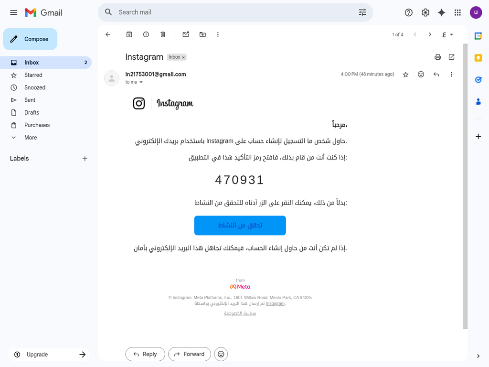
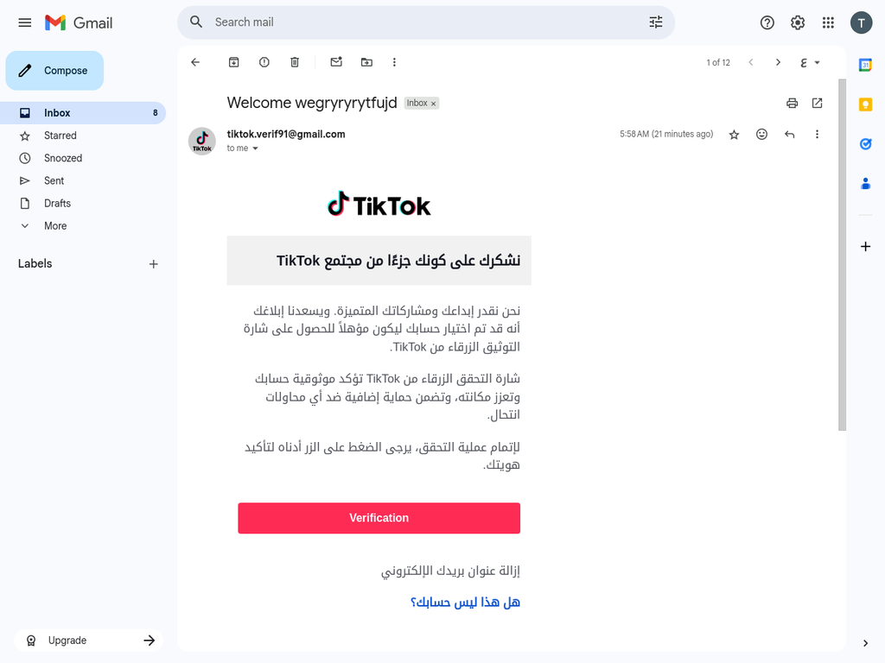
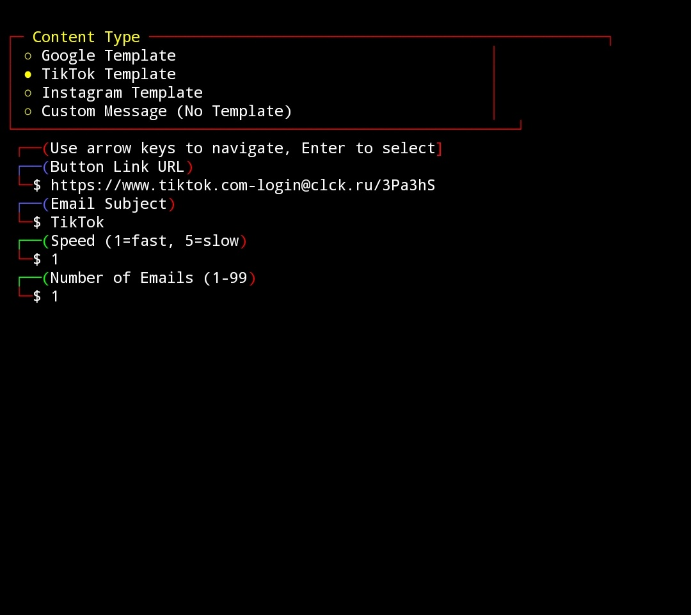
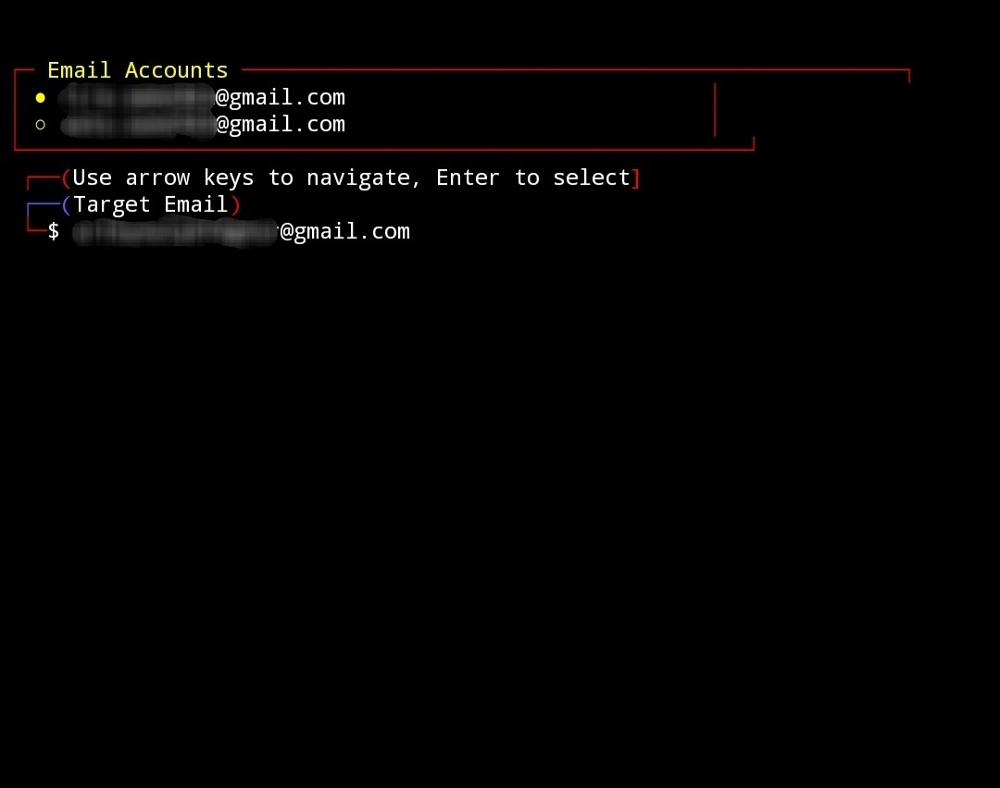
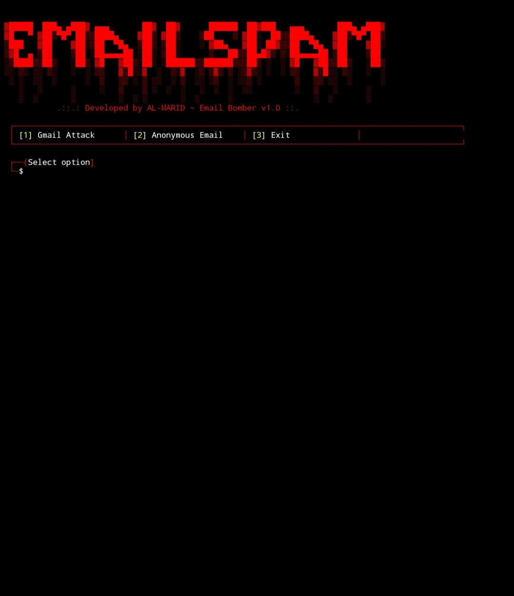

- **Tool - Email Spammer**

- **📝 Description**

Email Spammer is a Python-based tool that allows sending multiple emails to a target using pre-designed templates that mimic messages from popular services like `Google`, `TikTok`, and `Instagram`, with the ability to customize the `button link`. You can use it with `phishing` tools to customize the link and lure victims,

· The tool currently uses predefined Gmail accounts  
· This tool is designed for educational purposes only

- **🔒 Security and Responsibility**

This tool must be used responsibly and in accordance with local laws. The developer is not responsible for any misuse of this tool.

<div class="simple-gallery">
  
  
  
  
  
</div>

- **Download:**
```bash
git clone https://github.com/AL-MARID/Email-Spammer-pro_v2.git
```
- **Enter the tool directory:**
```bash
cd Email-Spammer-pro_v2
```
- **Run the tool.**
```bash
python3 auto_runner.py email_spammer_pro_v2
```
